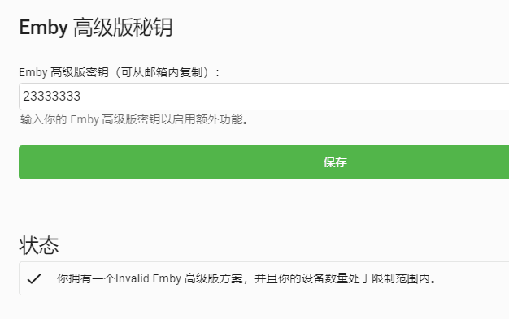

# EmbyUnlocked

## Introduction

Emby was free and developed under community, but there is a day they decided to invok there code into private status. There are some informations here: [Learn More](https://github.com/nvllsvm/emby-unlocked)

> Update 2019-01-17 - The Emby team has deleted the relevant GitHub isuses in an attempt to hide community backlash. Below are archived versions of those issues:
>
> [Issue 3075 - GPL Violation](https://web.archive.org/web/20181212044938/https://github.com/MediaBrowser/Emby/issues/3075)
>
> [Issue 3479 - Source Code Missing (Going Proprietary)](https://web.archive.org/web/20181212100152/https://github.com/MediaBrowser/Emby/issues/3479)

## Result



## Instructions - Server

Find some where safe to download our git repo

    git clone https://github.com/Co2333/embyUnlocked
    cd embyUnlocked

Modify the docker-compose.yml as you want

> See [LinuxServer/emby](https://github.com/linuxserver/docker-emby/) for configuration information

    nano ./docker-compose.yml
    docker-compose up --build

After build, run following command for maintain purpose

    docker-compose kill
    docker-compose up -d

## Instructions - Client

After the first start up, you will have your unlocked emby container image. Input any key will work. But this is not enough for unlock all feature because server activations and client activations are isolated between each of each.

#### You Are On Your Own To Unlock Client Features

---

#### Example - Using [Surge](nssurge.com)

- Requirement - Surge iOS/macOS with JS Engine Support

1 Download & Upload

- [emby-adr-v.js](./Surge/emby-adr-v.js)
- [emby-adr-vD.js](./Surge/emby-adr-vD.js)
- [emby-adr-gS.js](./Surge/emby-adr-gS.js)

Above files are required, Surge will download them automatically. Note that those file reqires to be accessible worldwide.

2 Insert Following Configuration

```
[Script]
emby-adr-vD.js = script-path=https://example.com/emby-adr-vD.js,requires-body=1,max-size=0,type=http-response,pattern=^https://mb3admin.com/admin/service/registration/validateDevice
emby-adr-v.js = script-path=https://example.com/emby-adr-v.js,requires-body=1,max-size=0,type=http-response,pattern=^https://mb3admin.com/admin/service/registration/validate
emby-adr-gS.js = script-path=https://example.com/emby-adr-gS.js,requires-body=1,max-size=0,type=http-response,pattern=^https://mb3admin.com/admin/service/registration/getStatus
```

3 Update Config & Resources in Surge

---

## License 

```
            DO WHAT THE FUCK YOU WANT TO PUBLIC LICENSE
                    Version 2, December 2004

 Copyright (C) 2004 Ihave Noname <idonthaveanemail@dowtf.com>

 Everyone is permitted to copy and distribute verbatim or modified
 copies of this license document, and changing it is allowed as long
 as the name is changed.

            DO WHAT THE FUCK YOU WANT TO PUBLIC LICENSE
   TERMS AND CONDITIONS FOR COPYING, DISTRIBUTION AND MODIFICATION

  0. You just DO WHAT THE FUCK YOU WANT TO.
```

2020.6.13 by [Ihave Noname]